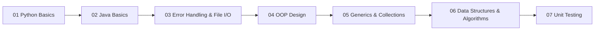

# SDE Learning Repository

A hands-on software development portfolio documenting my progression from Python fundamentals through Java, object-oriented design, data structures, algorithms, and unit testing. Projects are organized in a numbered curriculum (01–07) so each module builds on the last.

## Skills at a Glance

| Area | Technologies & Concepts |
|------|-------------------------|
| **Languages** | Python 3, Java |
| **Core concepts** | OOP, inheritance & polymorphism, generics, collections, exception handling, file I/O, serialization |
| **Data structures & algorithms** | Arrays, linked lists, stacks, queues, binary trees, hash maps, sorting, searching, recursion, Big-O analysis |
| **Testing** | JUnit, Mockito (mocks & stubs), test documentation |
| **Cloud & tooling** | AWS Lambda, S3, boto3, pandas, psutil |

## Featured Projects

| Project | Highlight |
|---------|-----------|
| [AWS Lambda](01_python_basics/AWS_Lambda/) | Serverless S3-triggered pipeline that reads CSV grade data and calculates pass/fail outcomes |
| [Virtual Coffee Machine](04_oop_design_principles/Virtual_Coffee_Machine_Project/) | Polymorphic beverage hierarchy with separation of concerns |
| [Postfix Calculator](06_data_structures_&_Algorithms/Postfix_Calculator/) | Dual stack implementations (array vs linked list) for expression evaluation |
| [Student Information System](06_data_structures_&_Algorithms/Student_Information_System/) | Composite application using multiple data structures for student records |
| [Library Search Engine](06_data_structures_&_Algorithms/Library_Search_Engine/) | Search, sort, and persist a book catalog with serialization |
| [Vehicle App Tests](07_Unit_Testing/VehicleApp_Test/) | MVC unit testing with documented test cases and results |
| [CoffeeMaker Mocks & Stubs](07_Unit_Testing/CoffeeMakerTest_AddingMocksAndStubs/) | Mockito-based isolation of dependencies in a coffee maker system |

## Learning Path



## Project Catalog

### [01 — Python Basics](01_python_basics/)

| Project | Language | Key Skills |
|---------|----------|------------|
| [Unit-Converter](01_python_basics/Unit-Converter/) | Python | Loops, conditionals, unit conversion |
| [Calculated_Bonus](01_python_basics/Calculated_Bonus/) | Python | Progressive calculations, functions |
| [Nested_Loop](01_python_basics/Nested_Loop/) | Python | Nested iteration, accumulation |
| [Computer_Performance](01_python_basics/Computer_Performance/) | Python | System monitoring, external libraries |
| [AWS_Lambda](01_python_basics/AWS_Lambda/) | Python | AWS Lambda, S3 events, pandas, boto3 |

### [02 — Java Basics](02_java_basics/)

| Project | Language | Key Skills |
|---------|----------|------------|
| [BMI_Calculator](02_java_basics/BMI_Calculator/) | Java | Classes, user input, conditional logic |
| [Bank_Teller_App](02_java_basics/Bank_Teller_App/) | Java | Queues, object interaction |
| [Car_Dash_Simulator](02_java_basics/Car_Dash_Simulator/) | Java | State management, simulation |
| [Chili_To_Go](02_java_basics/Chili_To_Go/) | Java | Methods, calculations |
| [Palindrome_Checker](02_java_basics/Palindrome_Checker/) | Java | String processing, CLI |

### [03 — Error Handling & File I/O](03_error_handling_and_file_io/)

| Project | Language | Key Skills |
|---------|----------|------------|
| [Grade_Reader](03_error_handling_and_file_io/Grade_Reader/) | Java | TSV parsing, file output, grading logic |
| [Idea_Reader](03_error_handling_and_file_io/Idea_Reader/) | Java | File reading, try-with-resources |
| [Menu_Reader](03_error_handling_and_file_io/Menu_Reader/) | Java | File parsing, exception handling |
| [Movie_Catalog](03_error_handling_and_file_io/Movie_Catalog/) | Java | File I/O, catalog management |
| [Student_Management_System](03_error_handling_and_file_io/Student_Management_System/) | Java | Try-catch, roster management |
| [Student_Search_Program](03_error_handling_and_file_io/Student_Search_Program/) | Java | Search, error handling |
| [Video_Settings_Serialization](03_error_handling_and_file_io/Video_Settings_Serialization/) | Java | Object serialization |

### [04 — OOP Design Principles](04_oop_design_principles/)

| Project | Language | Key Skills |
|---------|----------|------------|
| [Banking_System_Application](04_oop_design_principles/Banking_System_Application/) | Java | Encapsulation, class design |
| [Book_Information_Management_System](04_oop_design_principles/Book_Information_Management_System/) | Java | Inheritance, data modeling |
| [Die_Game](04_oop_design_principles/Die_Game/) | Java | Randomization, class hierarchy |
| [Virtual_Coffee_Machine_Project](04_oop_design_principles/Virtual_Coffee_Machine_Project/) | Java | Polymorphism, separation of concerns |

### [05 — Generics & Collections](05_generics_and_collections/)

| Project | Language | Key Skills |
|---------|----------|------------|
| [Generic_Value_Swapper](05_generics_and_collections/Generic_Value_Swapper_With_Display_Functionality/) | Java | Generics, type parameters |
| [Purchase_Tracking_System](05_generics_and_collections/Purchase_Tracking_System/) | Java | Collections, data tracking |
| [Reverse_Array](05_generics_and_collections/Reverse_Array/) | Java | Array manipulation, modular design |
| [Vehicle_App](05_generics_and_collections/Vehicle_App/) | Java | Inheritance, polymorphism |

### [06 — Data Structures & Algorithms](06_data_structures_&_Algorithms/)

| Project | Language | Key Skills |
|---------|----------|------------|
| [Array_Intersection_Optimization](06_data_structures_&_Algorithms/Array_Intersection_Optimization/) | Java | Array algorithms, optimization |
| [Binary_Search](06_data_structures_&_Algorithms/Binary_Search/) | Java | Binary search, O(log n) |
| [Even_Odd_Number_Processor](06_data_structures_&_Algorithms/Even_Odd_Number_Processor/) | Java | Custom stack & queue |
| [Generic_Binary_Tree](06_data_structures_&_Algorithms/Generic_Binary_Tree_Implementation/) | Java | Generic binary tree, Optional |
| [Improved_BubbleSort](06_data_structures_&_Algorithms/Improved_BubbleSort_Algorithm/) | Java | Sorting, optimization |
| [Library_Search_Engine](06_data_structures_&_Algorithms/Library_Search_Engine/) | Java | Maps, sorting, serialization |
| [Maximum_Subarray](06_data_structures_&_Algorithms/Maximum_Subarray/) | Java | Kadane's algorithm, Big-O |
| [MergedTester](06_data_structures_&_Algorithms/MergedTester/) | Java | HashMap merging |
| [Postfix_Calculator](06_data_structures_&_Algorithms/Postfix_Calculator/) | Java | Stack, LIFO, expression evaluation |
| [Recursive_Fibonacci](06_data_structures_&_Algorithms/Recursive_Fibonacci_Number/) | Java | Recursion |
| [Student_Information_System](06_data_structures_&_Algorithms/Student_Information_System/) | Java | Composite data structures |
| [Student_Registry_System](06_data_structures_&_Algorithms/Student_Registry_System/) | Java | Linked lists, waiting lists |

### [07 — Unit Testing](07_Unit_Testing/)

| Project | Language | Key Skills |
|---------|----------|------------|
| [NumberProcessorApp_Test](07_Unit_Testing/NumberProcessorApp_Test/) | Java | JUnit, model/view testing |
| [VehicleApp_Test](07_Unit_Testing/VehicleApp_Test/) | Java | MVC testing, test documentation |
| [CoffeeMaker Mocks & Stubs](07_Unit_Testing/CoffeeMakerTest_AddingMocksAndStubs/) | Java | Mockito, dependency isolation |

## Getting Started

Projects do not use a shared build system. Run them individually from their project folder.

**Python**

```bash
cd 01_python_basics/Unit-Converter
python main.py
```

**Java (command line)**

```bash
cd 02_java_basics/Bank_Teller_App/src
javac *.java
java Main
```

**Java (IDE)** — Open a project folder in IntelliJ IDEA or Eclipse, then run the main class or JUnit tests from the IDE.

**Unit tests** — Open a test project (e.g. `07_Unit_Testing/VehicleApp_Test/`) in your IDE and run JUnit test classes.

## Repository Structure

```
SDE-Learning-Repository/
├── 01_python_basics/          # Python fundamentals (5 projects)
├── 02_java_basics/            # Java fundamentals (5 projects)
├── 03_error_handling_and_file_io/  # Exceptions & file handling (7 projects)
├── 04_oop_design_principles/  # Object-oriented design (4 projects)
├── 05_generics_and_collections/    # Generics & Java collections (4 projects)
├── 06_data_structures_&_Algorithms/  # DSA & complexity (12 projects)
└── 07_Unit_Testing/           # JUnit & Mockito (3 projects)
```

Each module folder contains a README with project summaries and a suggested reading order. Individual project folders include their own README with details and run instructions.
